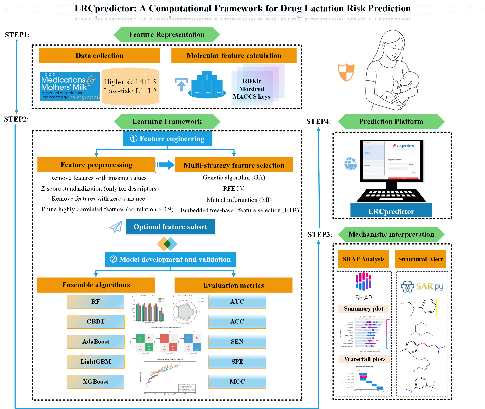

# LRCpredictor: A Computational Framework for Drug Lactation Risk Prediction

[](https://lrcpredictor.streamlit.app/)

## 📋 Overview

LRCpredictor is a novel interpretable machine learning framework for predicting clinically actionable lactation risk categories of drugs based on Dr. Thomas Hale's evidence-based Lactation Risk Categories (LRC) system. Unlike existing computational models that focus on pharmacokinetic surrogate endpoints (milk-to-plasma ratios), LRCpredictor directly predicts composite risk classifications to support therapeutic decision-making for breastfeeding medication safety.


*Schematic workflow of the LRCpredictor framework for lactation risk prediction.*

## 🌟 Key Features

- **Clinically Actionable Predictions**: Direct classification of drugs into low-risk (L1/L2) vs. high-risk (L4/L5) categories
- **High Performance**: Test set AUC of 0.8105 and MCC of 0.4926; exceptional performance for extreme categories (L1 vs L5: AUC = 0.9000, MCC = 0.7031)
- **Interpretable Framework**: Integrated SHAP analysis reveals molecular determinants driving lactation risk predictions
- **Web-Based Platform**: Freely accessible online tool with real-time SHAP visualization
- **Comprehensive Dataset**: 392 drugs with documented lactation risk classifications from the latest 2025-2026 LRC system

## 🚀 Online Prediction Platform

Access the web-based prediction tool: **[https://lrcpredictor.streamlit.app/](https://lrcpredictor.streamlit.app/)**

The platform supports:
- Individual and batch prediction modes
- SMILES notation input
- Real-time SHAP force plot visualization
- Transparent molecular-level explanations for each prediction

## 📊 Dataset

The dataset includes 392 carefully curated compounds with documented lactation risk classifications:

| Dataset | High-risk (L4/L5) | Low-risk (L1/L2) | Total |
|---------|-------------------|------------------|-------|
| Training Set | 150 | 163 | 313 |
| Test Set | 31 | 48 | 79 |
| **Total** | **181** | **211** | **392** |

### Files:
- `LRC_Training Set.xlsx` - Training set with 313 compounds
- `LRC_Test Set.xlsx` - Test set with 79 compounds

Each dataset contains:
- Drug names and SMILES structures
- Lactation risk categories (L1, L2, L4, L5)
- Molecular descriptors and fingerprints

## 🔧 Repository Structure
```
LRCpredictor/
│
│
├── DataSet/                           # Molecular descriptors and training data
│   ├── LRC_dataset.sdf                # Original molecular structure file
│   ├── LRC_Training_Set.xlsx          # Training dataset (n=313)
│   ├── LRC_Test_Set.xlsx              # Test dataset (n=79)
│   ├── RDKit.csv                      # RDKit descriptors
│   ├── Mordred.csv                    # Mordred descriptors
│   ├── MACCS.csv                      # MACCS keys fingerprints
│   ├── RDKit+MACCS.csv                # Combined RDKit and MACCS features
│   ├── Mordred+MACCS.csv              # Combined Mordred and MACCS features
│   ├── Mordred+RDKit.csv              # Combined Mordred and RDKit features
│   └── Mordred+RDKit+MACCS.csv        # All three descriptor types combined
│
│
├── molecular_descriptor_calculator.py  # Script for calculating molecular descriptors
│   ├── RDKit descriptor calculation
│   ├── Mordred descriptor calculation
│   └── MACCS keys fingerprint generation
│
│
├── LRCpredictor_code/                          # Model development code and datasets
│   ├── LRCpredictor.ipynb                      # Complete workflow notebook
│   │   ├── Feature preprocessing
│   │   ├── Feature selection (GA, RFECV, MI, ETB)
│   │   └── Model development (RF, GBDT, AdaBoost, LightGBM, XGBoost)
│   ├── TrainingSet_LRC_Mordred+RDKit_MACCS.csv # Training data with selected features
│   └── TestSet_LRC_Mordred+RDKit_MACCS.csv     # Test data with selected features
│
│
├── LRCpredictor_Demo
│   ├── README.md                             
│   ├── LRCpredictor_Demo.py                   # Demonstration script (Python)
│   ├── gbdt_lactation_risk_pipeline.pkl       # Trained GBDT model
│
│
│
├── app.py                             # Streamlit web application
├── gbdt_lactation_risk_pipeline.pkl   # Trained GBDT model with scaler
├── requirements.txt                   # Python package dependencies
└── README.md                          # Project documentation
```

## 💻 Installation & Usage


### Local Installation

1. Clone the repository:
```bash
git clone https://github.com/Huangxiaojie2024/LRCpredictor.git
cd LRCpredictor
```

2. Install dependencies:
```bash
pip install -r requirements.txt
```

### Running the Jupyter Notebook

Open and run `LRCpredictor.ipynb` to reproduce:
- Feature calculation and preprocessing
- Feature selection strategies
- Model training and evaluation
```bash
jupyter notebook LRCpredictor.ipynb
```

### Running the Web Application Locally
```bash
streamlit run app.py
```

The application will open in your browser at `http://localhost:8501`

## 🧪 Model Performance

### Overall Performance (L1/L2 vs L4/L5)
- **Test Set AUC**: 0.8105
- **Test Set MCC**: 0.4926
- **Accuracy**: 74.68%
- **Sensitivity**: 77.42%
- **Specificity**: 72.92%

### Extreme Categories Performance (L1 vs L5)
- **Test Set AUC**: 0.9000
- **Test Set MCC**: 0.7031
- **Accuracy**: 85.19%
- **Sensitivity**: 82.35%
- **Specificity**: 90.00%

## 🔬 Methodology

### Feature Engineering
- **Mordred descriptors**: 1,613 2D molecular features
- **RDKit descriptors**: 208 physicochemical properties
- **MACCS fingerprints**: 166 structural patterns
- **Optimal subset**: 35 features selected via Embedded Tree-Based (ETB) method

### Machine Learning Algorithms
- Random Forest (RF)
- Gradient Boosting Decision Trees (GBDT) - **Best performer**
- Adaptive Boosting (AdaBoost)
- Light Gradient Boosting Machine (LightGBM)
- Extreme Gradient Boosting (XGBoost)

### Model Interpretability
SHAP (SHapley Additive exPlanations) analysis reveals key molecular determinants:
- Electronic properties (GATS2i, BCUTi-1l)
- Structural topology (AATS3v, SpMax_A, VR1_A)
- Electrotopological states (VSA_EState1, MaxEStateIndex)
- Drug-likeness and polarizability (QED, ATSC5p, BCUT2D_MRLOW)

## 📝 Citation

If you use LRCpredictor in your research, please cite:
```bibtex
@article{liu2025lrcpredictor,
  title={An Interpretable Machine Learning Framework for Predicting Lactation Risk of Drugs: A Data-Driven Approach to Enhance Breastfeeding Medication Safety},
  author={Liu, Peineng and Huang, Shaokai and Xie, Xiaochun and Chen, Jiajia and Wu, Shanshan and Huang, Lina and Huang, Xiaojie},
  journal={[ ]},
  year={2025},
  note={Manuscript in preparation}
}
```


## 🤝 Contributing

We welcome contributions! Please feel free to submit issues or pull requests.

## 📧 Contact

For questions or collaborations, please contact:
- **Dr. Xiaojie Huang**: huangxj46@alumni.sysu.edu.cn

## 🙏 Acknowledgments

We thank Dr. Thomas Hale for developing the evidence-based Lactation Risk Categories system that serves as the foundation for this work.

## ⚠️ Disclaimer

LRCpredictor is a research tool designed to support clinical decision-making, not replace professional medical judgment. Healthcare providers should consider individual patient circumstances, latest clinical evidence, and consult specialized references before making therapeutic decisions regarding breastfeeding medication safety.

---

**Last Updated**: December 2025
